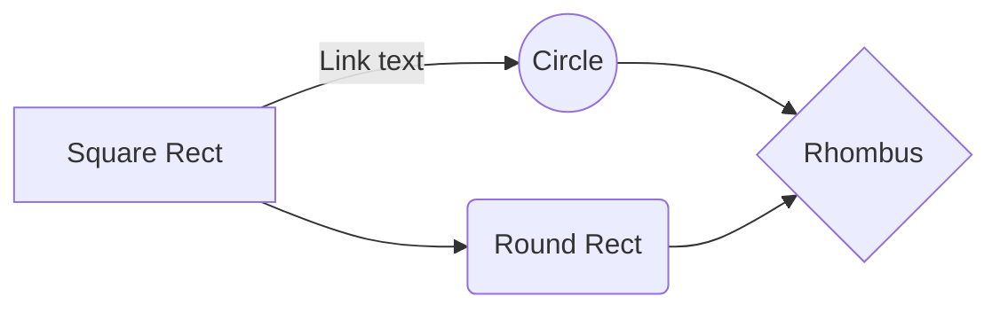

# Listas Ligadas(Simples)

## Definição
É uma estrutura de dados linear e dinâmica. Uma lista ligada é um conjunto de nós que por sua vez são compostos por dois membros. Uma parte que armazena os dados(neste caso `int valor`) e um apontador para o próximo elemento da lista.

```
+---+---+    +---+---+    +---+------+
| 1 | p-|--->| 2 | p-|--->| 3 | NULL |
+---+---+    +---+---+    +---+------+
```
> Lista ligada com 3 nós no último nó temos um apontador para NULL para simpolizar o fim da lista

Implementação de uma lista ligada em C:
```c
struct No {
	int valor;
	struct No *prox;
};

typedef struct No *LLint;
```
Primeiro definimos a `struct No` que vai representar cada nó da lista e de seguida definimos `LLint` como um apontador para um `No` de forma a podermos representar uma lista vazia.

## Operações
Listas ligadas são bastante versáteis permitindo tanto inserção como eliminação de elementos no ínicio, no fim e no meio da lista. 

### Inserção no ínicio
```c
// Também denominado de "push"
void insert_front(LLint *lista, int valor) {
	LLint novo = malloc(sizeof(struct LLint));
	novo->valor = valor;
	novo->prox = *lista;
	*lista = novo;
}
```
1. Alocamos espaço para o novo elemento
2. Atribuímos o valor
3. Apontamos o novo para a cabeça da lista
4. Atualizamos a referência à cabeça


### Inserção no fim
```c
// Nomenclatura alternativa "append"
void insert_end(LLint *lista, int valor) {
	LLint cursor = *lista;
	LLint novo = malloc(sizeof(struct LLint));
	novo->valor = valor;
	novo->prox = NULL;
	
	if (*lista = NULL) {
		*lista = novo;
		return;
	}

	while(cursor->prox != NULL) {
		cursor = cursor->prox;
	}
	cursor->prox = novo;
}
```
1. Alocamos espaço para o novo elemento
2. Atribuímos o valor
3. Apontámos o `novo` para `NULL`
4. Verificamos o caso de a lista ser vazia
5. Percorremos a lista até ao fim
6. Apontámos o fim da lista para o `novo`

### Inserção no meio
```c
void insert_at(LLint *lista, int valor, int indice) {  
	LLint cursor = *lista;  
	LLint anterior = NULL;  
	LLint novo = (LLint) malloc(sizeof(struct LLint));  
	novo->valor = valor;  
	novo->prox = NULL;  

	if (*lista == NULL) {  
		*lista = novo;  
		return;
	}  

	while(cursor->prox != NULL && indice) {  
		indice--;  
		anterior = cursor;  
		cursor = cursor->prox;  
	}  

	novo->prox = cursor;  

	if (anterior == NULL) {  
		*lista = novo;  
	} else {  
		anterior->prox = novo;  
	}  
}
```
1. Alocamos espaço para o novo elemento
2. Atribuímos o valor
3. Apontámos o `novo` para `NULL`
4. Verificamos o caso de a lista ser vazia
5. Iteramos a lista até ao `indice` ou até ao fim
6. Apontámos o `novo` para o nó seguinte da lista
7. Verificamos o caso de o `indice` ser 0
8. Apontamos o nó anterior/cabeça para o `novo`

### Eliminar primeiro nó
```c
void delete_start(LLint *lista) {
	if (*lista == NULL) return;
	LLint temp = *lista;
	*lista = temp->prox;
	free(temp);
}
```
1. Verificar se a lista é vazia
2. Inicializar apontador temporário com cabeça da lista
3. Atualizar referência da cabeça
4. Libertar memória do nó eliminado

### Eliminar último nó
```c
void delete_end(LLint *lista) {
	if (*lista == NULL) return;
	LLint cursor = *lista;  
	LLint anterior = NULL;  

	while(cursor->prox != NULL) {  
		anterior = cursor;  
		cursor = cursor->prox;  
	}  

	if (anterior == NULL) {  
		*lista = NULL;  
	} else {  
		anterior->prox = NULL;  
	}  
}
```
1. Verificar se a lista é vazia
2. Alocar nó temporário e inicializa-lo cabeça da lista
3. Atualizar referência da cabeça
4. Libertar memória do nó eliminado

### Eliminar nó do meio
```c
void delete_at(LLint *lista, int indice) {
	if (*lista == NULL) return;
	LLint cursor = *lista;  
	LLint anterior = NULL;  

	while(cursor->prox != NULL && indice) {  
		indice--;  
		anterior = cursor;  
		cursor = cursor->prox;  
	}  

	if (indice) return; // se o indice exceder o comprimento da lista

	if (anterior == NULL) {  
		*lista = cursor->prox;
	} else {
		anterior->prox = cursor->prox;
	}

	free(cursor);  
}
```


## Complexidade das operações
-   Inserção
    -   Cabeça O(1)
    -   Cauda O(n) (O(1) quando se tem uma referência pro fim da lista)
    -   Meio O(n)

-   Eliminação
    -   Cabeça O(1)
    -   Cauda O(n) (O(1) quando se tem uma referência pro fim da lista)
    -   Meio O(n)


## UML diagrams

You can render UML diagrams using [Mermaid](https://mermaidjs.github.io/). For example, this will produce a sequence diagram:


